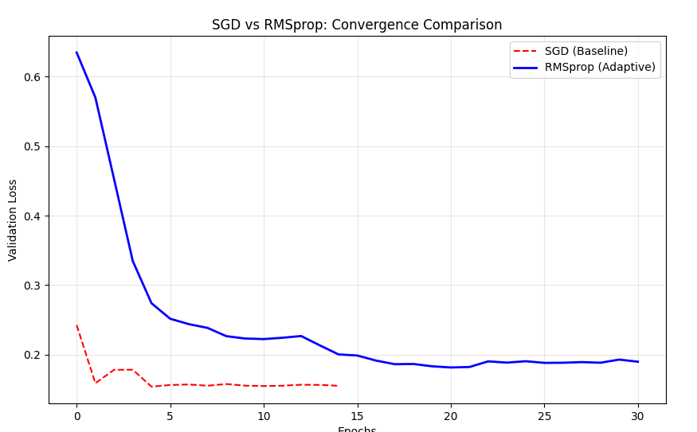

# Multilayer Perceptron

A from-scratch implementation of a Multilayer Perceptron (MLP) in Python using **pure NumPy** — no TensorFlow, no PyTorch. Built to classify Malignant (`M`) vs Benign (`B`) tumors from a 30-feature dataset (Breast Cancer Wisconsin).



---

## Features

- Fully custom neural network library built on NumPy
- Mini-batch gradient descent with stochastic shuffling
- Two optimizers: **SGD** and **RMSprop**
- Early stopping with best-model checkpointing
- He Uniform weight initialization
- Categorical Cross-Entropy (train) + Binary Cross-Entropy (validation)

---

## Project Structure

```
multilayer-perceptron/
├── data/
│   └── data.csv                # 30-feature dataset (labels col 1, features col 2+)
├── model/
│   ├── best_model.npy          # Saved weights from best epoch
│   └── history_*.json          # Training loss history
├── src/
│   ├── activations.py          # Sigmoid, Softmax
│   ├── layers.py               # Dense layer
│   ├── loss.py                 # CCE + BCE loss functions
│   ├── network.py              # Model class, forward/backward pass, training loop
│   ├── plot_history.py         # Training curve utilities
│   └── utils.py                # Save/load helpers
├── train.py                    # CLI training script
├── predict.py                  # Load model + evaluate
├── split_data.py               # StandardScaler + train/test split
└── requirements.txt
```

---

## Installation

```bash
# Clone the repository
git clone https://github.com/your-username/multilayer-perceptron
cd multilayer-perceptron

# Create and activate a virtual environment (recommended)
python3 -m venv venv
source venv/bin/activate

# Install dependencies
pip install -r requirements.txt
```

---

## Usage

### 1. Prepare the data

Place `data.csv` inside the `data/` directory before running any script.

### 2. Train the model

```bash
python train.py \
  --layers 24 24 24 \
  --epochs 84 \
  --loss categoricalCrossentropy \
  --batch_size 8 \
  --learning_rate 0.0314 \
  --optimizer sgd
```

| Argument | Description | Default |
|---|---|---|
| `--layers` | Hidden layer sizes (space-separated) | `24 24 24` |
| `--epochs` | Number of training epochs | `84` |
| `--loss` | Loss function (`categoricalCrossentropy`) | `categoricalCrossentropy` |
| `--batch_size` | Mini-batch size | `8` |
| `--learning_rate` | Learning rate α | `0.0314` |
| `--optimizer` | `sgd` or `rmsprop` | `sgd` |

> Trained weights and history are saved automatically to `model/`. Early stopping halts training when validation loss stops improving for 10 consecutive epochs.

### 3. Evaluate the model

```bash
python predict.py
```

Outputs: **BCE Loss**, **Precision**, **Recall**, **F1-Score**, **Confusion Matrix**, **Accuracy**.

---

## Technical Details

### Architecture

Each `Dense` layer applies a linear transformation followed by a non-linear activation:

$$Z^{[l]} = W^{[l]} A^{[l-1]} + b^{[l]}, \qquad A^{[l]} = g\!\left(Z^{[l]}\right)$$

### Activations

- **Sigmoid** (hidden layers) — input clipped to `[-500, 500]` to prevent overflow
- **Softmax** (output layer) — stabilized by subtracting `max(Z)` before exponentiation

### Loss Functions

**Categorical Cross-Entropy** (training):

$$L_{\text{CCE}} = -\frac{1}{m}\sum_{i=1}^{m}\sum_{k=1}^{C} y_k^{(i)}\log\hat{y}_k^{(i)}$$

**Binary Cross-Entropy** (validation — probabilities clipped at ε = 1e-15):

$$L_{\text{BCE}} = -\frac{1}{m}\sum_{i=1}^{m}\left(y^{(i)}\log\hat{y}^{(i)} + (1-y^{(i)})\log(1-\hat{y}^{(i)})\right)$$

### Backpropagation

Starting from the output delta (Cross-Entropy + Softmax simplification):

$$dZ^{[L]} = A^{[L]} - y$$

$$dW^{[l]} = \frac{1}{m}\,dZ^{[l]}\cdot(A^{[l-1]})^T, \qquad dB^{[l]} = \frac{1}{m}\sum_{i=1}^{m}dZ^{[l]}$$

$$dZ^{[l-1]} = (W^{[l]})^T \cdot dZ^{[l]}\ *\ g'(Z^{[l-1]})$$

### Optimizers

**SGD:**

$$W^{[l]} = W^{[l]} - \alpha \cdot dW^{[l]}$$

**RMSprop** (β = 0.9, ε = 1e-8):

$$v_{dW} = \beta\, v_{dW} + (1-\beta)(dW^{[l]})^2, \qquad W^{[l]} = W^{[l]} - \frac{\alpha}{\sqrt{v_{dW}}+\epsilon}\,dW^{[l]}$$

### Weight Initialization (He Uniform)

$$\text{limit} = \sqrt{\frac{6}{n^{[l-1]}}}, \qquad W \sim \mathcal{U}(-\text{limit},\ \text{limit})$$

---

## Requirements

```
numpy
pandas
matplotlib
scikit-learn
```